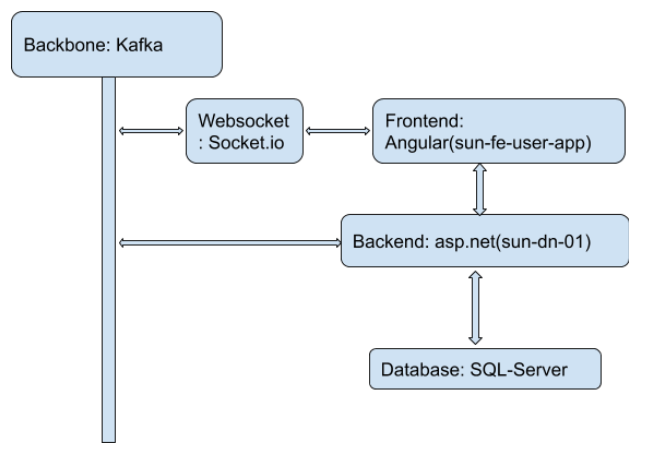

# asp.net-angular-mssql
 
1. architecture  

1. setup  
   1. run sql-server in docker:  
 docker run -d --name sun_sql_server -e 'ACCEPT_EULA=Y' -e 'SA_PASSWORD=sun.123456' -p 1433:1433 mcr.microsoft.com/mssql/server:2019-latest  
 install sql-cli  
   1. set up sql-server connection in .net backend  
   1. init database: dotnet ef migrations add DataModels and dotnet ef database update  
   1. run Zookeeper and Kafaka: download Kafaka, ./bin/zookeeper-server-start.sh ./config/zookeeper.properties and ./bin/kafka-server-start.sh ./config/server.properties  
   1. create topics: ./bin/kafka-topics.sh --create --zookeeper localhost:2181 --replication-factor 1 --partitions 5 --topic new-user  
 ./bin/kafka-topics.sh --create --zookeeper localhost:2181 --replication-factor 1 --partitions 5 --topic new-voting  
   1. run web-socket server: cd sunWsServer, npm start dev  
   1. run backend (sunny-dn-01) and frontend (sun-fe-user-app)  
 
1. notice  
   1. to implement the CQRS, the MediatR is used in the backend.  
   1. to implement the async communication between the frontend and kafka, socket.io is in used  
   1. if a new user/voting is created, the backend will publish this event with kafka, the web-socket-server will consume this event and send the event to all sockets, at the end all with web-socket connected frontends will receive this event and update the pages.  
   1. to use EF in the new .net version, the IncludeAsset must be commented in the project file(.csproj)like:  <PackageReference Include="Microsoft.EntityFrameworkCore.Design" Version="5.0.2">
      <!-- Remove IncludeAssets to allow compiling against the assembly -->
      <!--<IncludeAssets>runtime; build; native; contentfiles; analyzers; buildtransitive</IncludeAssets> -->
      <PrivateAssets>all</PrivateAssets>
    </PackageReference>
 

 
 
